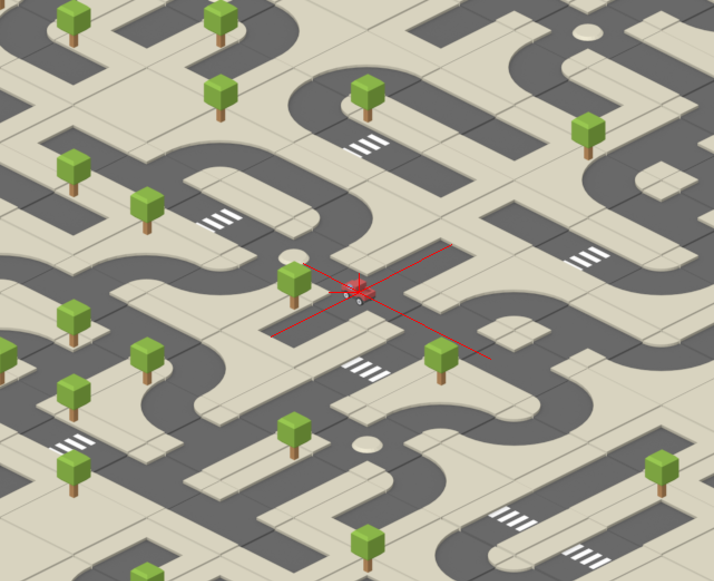

# City
Simple City in PyGame using wave function collapse to generate.

Control car: `w s a d`
Control camera: `arrows`

Project was created to explore reinforcment learning, but it is too hard as first project.
